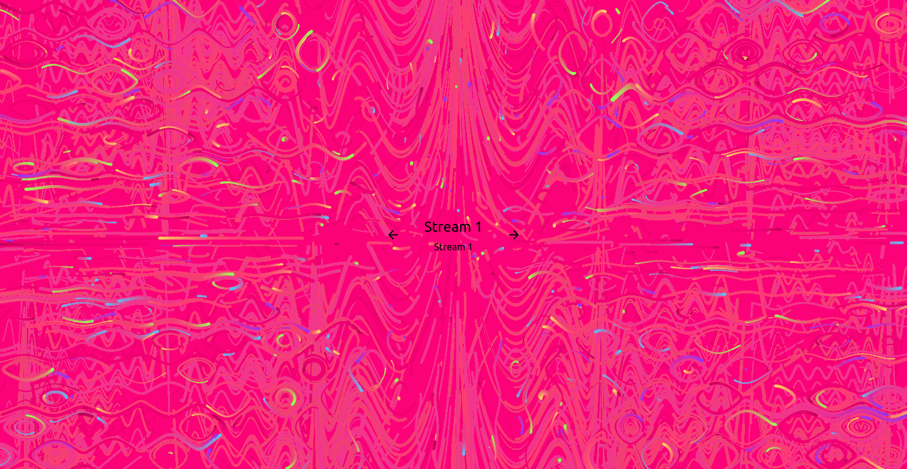
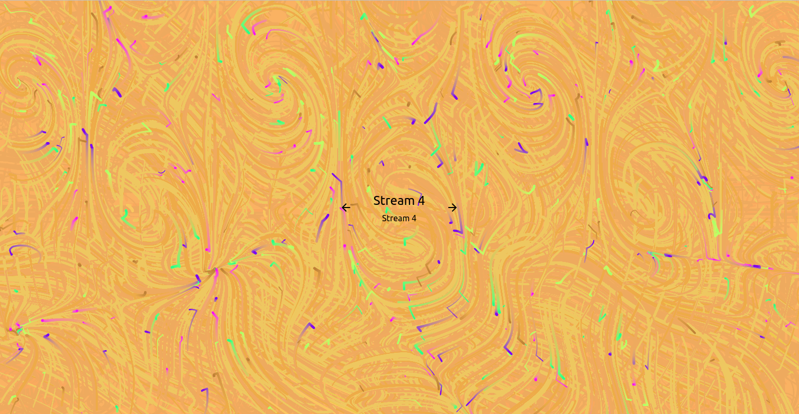

# StreamDisco

> A react webapp for hosting silent discos, no equipment required.

Traditional Silent Discos require a large investment in headphones which must be
purchased by the organizer, must be configured and tuned to the correct station,
can be stolen or break, and are typically lower-quality than what people would
prefer to listen to. Instead, SteamDisco simply asks dancers to bring their own
headphones, and makes streams available through an intuitive, simple, and
colorful interface.





## Installation + Development

You'll need to provide your own `data.ts` file, specifying each source's
stream, color, title, subtitle, etc. You can use this one as an example:

```ts
export default {
  // you can also specify a specific iso timestamp
  startsAt: new Date().toISOString(),
  streams: [
    {
      color: "#f6557e",
      title: "Stream 1",
      subtitle: "Stream 1",
      url:
        "https://soundcloud.com/littkemusic/funk-of-the-future-high-energy-future-funk-mix",
    },
  ],
};
```

Run `npm install` (or `yarn`) to install the required libraries, and then run
`npm start` (or `yarn start`) to begin running a development server to test out
your changes.

## Meta

Zack Littke-Smith

Distributed under the MIT license. See `LICENSE` for more information.

[https://github.com/zackls/StreamDisco](https://github.com/zackls/StreamDisco)

## Contributing

1. Fork it (<https://github.com/zackls/SteamDisco/fork>)
2. Create your feature branch (`git checkout -b feature/fooBar`)
3. Commit your changes (`git commit -am 'Add some fooBar'`)
4. Push to the branch (`git push origin feature/fooBar`)
5. Create a new Pull Request
